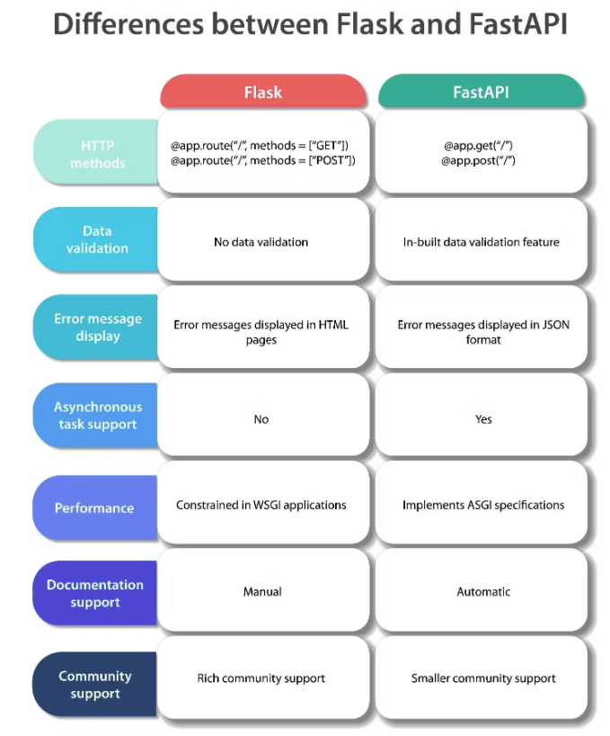

# RestfulAPI
A REST API (also called a RESTful API or RESTful web API) is an application programming interface (API) that conforms to the design principles of the representational state transfer (REST) architectural style.  
- `Flask` is a Python-based lightweight Web Server Gateway Interface (WSGI) web application framework.  
- `FastAPI` is a modern, fast (high-performance), Asynchronous Server Gateway Interface (ASGI) web framework for building APIs with Python 3.7+ based on standard Python type hints.  
    -  many world-renowned companies such as `Uber`, `Netflix` and `Microsoft` use FastAPI to build their applications.  



# FAST API
HTTP request CRUD
- **GET**: Read and retrieve data. Supports query and path parameters.
    - Query parameters, `@app.get("/books/")`
    - Path paramters, `@app.get("/books/author/{book_author}")`
- **POST**: Create resources and submit data.
    - `@app.post("/books/")`
- **PUT**: Update entire resources, requiring all relevant fields to be provided.
    - `@app.put("/books/{book_id}")`
- **PATCH**: Partially update resources, modifying only the fields that need changes without affecting others.
    - `@app.patch("/books/{book_id}")`
- **DELETE**: Remove resources.
    - `@app.delete("/books/{book_id}")`

HTTP `status code`
- **1xx**: Informational responses indicating the request was received and processing is continuing.
- **2xx**: Success codes confirming the request was successfully received, understood, and accepted.
- **3xx**: Redirection codes indicating further action is needed to complete the request.
- **4xx**: Client error codes showing the request contains bad syntax or cannot be fulfilled.
- **5xx**: Server error codes indicating the server failed to fulfill an apparently valid request.

To run `main.py`
```
uvicorn main:app --reload --port 8081
```

## Path & Query Parameters
- `Path Parameters` : request parameters that have been attached to the URL
    ```
    book_id: int = Path(gt=0, title="The ID of the book", description="The ID must be a positive integer")
    ```

- `Query Parameters` : request parameters that have been attached after a “?”
    - Query Parameters have `name=value` pairs. In below example, 'author%20four' is path parameter, 'category=science' is query parameter
    ```
    URL : 127.0.0.1:8000/books/author%20four/?category=science
    code:
    @app.get(“/books/{book_author}/”)
    async def read_category_by_query(book_author: str, category: str):
    ```


## Starlette features
- **Status Codes**: Customizable responses.
```
@app.get("/books/", status_code=status.HTTP_200_OK)
```
- **Background Tasks**: Execute functions in the background.
```
background_tasks.add_task(<task_function>, <arguments>)
```
- **WebSocket Support**: Real-time communication.
```
@app.websocket("/ws/")
async def websocket_endpoint(websocket: WebSocket):
    await websocket.accept()
    while True:
        data = await websocket.receive_text()
        await websocket.send_text(f"Message text was: {data}")
```
- **Session and Cookie Support**: Store and manage user session data.
    - cookie : store information on the browser for response, and use for request in the future

## Pydantic features
- **Data Validation**: Ensure data integrity through models.
    - `Field` for data verification
        - Field is a function from Pydantic used to provide validations and metadata for model attributes.
        - `min_length`, `max_length`, `gt`, and `lt`
        - `json_schema_extra`, which is used for documentation purposes

```
class Book(BaseModel):
    title: str
    description: str
    rating: int
    class Config:
        json_schema_extra = {
            "example": {
                "title": "The Catcher in the Rye",
                "description": "A story
                "rating": 5
            }
        }
```

- **Serialization**: Convert models to dictionaries for JSON responses.
    - `.model_dump()` to convert the model to a dictionary

```
async def create_book(book: Book):
    new_book = Book(**book.model_dump())
```

- **form_data** : avoid writing pydantic model, use `Form` from `fastapi` to parse form data
```
from fastapi import Form
@app.post("/login/")
async def login(username: str = Form(...), password: str = Form(...)):
    return {"username": username}
```


## Security
FastAPI provides built-in support for security and authentication, including:
- **JSON Web Tokens (JWT)**: A method for securely transmitting information between parties as a JSON object.
    - A JWT is composed of three parts, separated by dots (.):
        - Header: Contains metadata about the type of token and the signing algorithm used.
        - Payload: Contains the claims (statements about an entity and additional data). One of these claims can be the exp claim, indicating the expiration time.
        - Signature: Used to verify that the sender of the JWT is who it says it is and to ensure that the message wasn't changed along the way.
    - test on [jwt io](https://jwt.io/)
    - `python-jose` : a library for JWT

- **Dependency Injection**: Reuse shared logic across the application, such as database connections and authentication.
    -  particularly useful for when you need to access the database or current user information to create or modify resources.
```
db_dependency = Annotated[Session, Depends(get_db)]
user_dependency = Annotated[dict, Depends(get_current_user)]

@router.post('/items/', status_code=status.HTTP_201_CREATED)
async def create_item(item: ItemCreate, db: db_dependency, user: user_dependency):
    ...
```
## Router
Router is a class that includes a set of path operations, and can include sub-routers.
```
router = APIRouter(
    prefix='/auth',
    tags=['auth']
)
@router.get("/todo", status_code=status.HTTP_200_OK)

```
## Error Handling and Logging
- **HTTPException**: Handle errors gracefully and return meaningful error responses.
```
@app.get("/items/{item_id}")
async def read_item(item_id: str):
    if item_id not in items:
        raise HTTPException(status_code=404, detail="Item not found")
    return {"item": items[item_id]}
```
- **Logging**: Track events, errors, and application behavior.

## Testing
- **Unit and Integration Testing**: Ensure code reliability and functionality with `pytest`.

## File handling
File: used to handle file uploads
UploadFile : used to handle file uploads
FileResponse : used to return files as responses
app.mount() : mount the static files
StaticFiles : used to serve static files such as images, CSS, and JavaScript files

```
from fastapi.staticfiles import StaticFiles
app = FastAPI()
app.mount("/static", StaticFiles(directory="static"), name="static")
```

## logging
- `logging` module
```
import logging
logging.basicConfig(level=logging.INFO,
                    format='%(asctime)s - %(levelname)s - %(message)s',
                    datefmt='%Y-%m-%d %H:%M:%S')

logger = logging.getLogger(__name__)
logger.info("Info message")
logger.debug("Debug message")
```

## Middleware
You can add middleware to FastAPI applications.  
A "middleware" is a function that works with every request before it is processed by any specific path operation. And also with every response before returning it.  
To create a middleware you use the decorator @app.middleware("http") on top of a function.  

```
@app.middleware("http")
async def add_process_time_header(request: Request, call_next):
    start_time = time.time()
    response = await call_next(request)
    process_time = time.time() - start_time
    response.headers["X-Process-Time"] = str(process_time)
    return response
```

# FAST API concurrency
Modern versions of Python have support for "asynchronous code" using something called "coroutines", with async and await syntax.  

Let's see that phrase by parts in the sections below:  
- Asynchronous Code
- async and await
- Coroutines


# Reference
- [FastAPI Official Doc](https://fastapi.tiangolo.com/)
- [Create a streaming AI assistant with ChatGPT, FastAPI, WebSockets and React](https://dev.to/dpills/create-a-streaming-ai-assistant-with-chatgpt-fastapi-websockets-and-react-3ehf)
- [Complete FastAPI masterclass from scratch](https://www.udemy.com/course/completefastapi/learn/lecture/32788640#overview)
- [fastapi-the-complete-course](https://github.com/codingwithroby/fastapi-the-complete-course)
- [Python FastAPI vs Flask](https://www.turing.com/kb/fastapi-vs-flask-a-detailed-comparison)
- [Learn everything about FastApi with Python](https://www.udemy.com/course/completefastapi/learn/lecture/28660302#overview)
- [OpenAI, GPT, ChatGPT, DALL-E and FastAPI](https://www.udemy.com/course/the-complete-chatbot-bootcamp/learn/lecture/39165950#overview)
- [WebSockets](https://fastapi.tiangolo.com/advanced/websockets/)