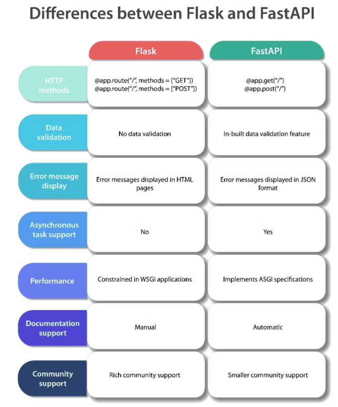

# RestfulAPI
A REST API (also called a RESTful API or RESTful web API) is an application programming interface (API) that conforms to the design principles of the representational state transfer (REST) architectural style.  
- `Flask` is a Python-based lightweight Web Server Gateway Interface (WSGI) web application framework.
- `FastAPI` is a modern, fast (high-performance), Asynchronous Server Gateway Interface (ASGI) web framework for building APIs with Python 3.7+ based on standard Python type hints.
    -  many world-renowned companies such as `Uber`, `Netflix` and `Microsoft` use FastAPI to build their applications.  



# FAST API
HTTP request CRUD
- get : read and retrieve data
    - Path paramters, `@app.get("/books/author/{book_author}")`
- post : create method and submit data
- put : update the entire resource, it is expected to provide all the relevant fields of the resource
- patch : update part of the resource, Clients only need to send the fields that should be changed, without affecting other existing fields
- delete : delete the resource

request method
- trace
- connect
- options

status code
- 1xx : Informational responses, request received and continuing process
- 2xx : Success, request was successfully received, understood, and accepted
- 3xx : Redirection, further action needs to be taken in order to complete the request
- 4xx : Client errors, request contains bad syntax or cannot be fulfilled
- 5xx : Server errors, server failed to fulfill an apparently valid request

json web token structure
- header
    - JWT header
        - algorithm
        - type
- payload
- signature

# Preperation
Install environment:
```
python -m pip install -r requirement.txt
```

Optional, if you want to work with SQLite:
```
sudo apt update
sudo apt install sqlite3
```
Then in terminal, type `sqlite3` to enter the SQLite shell and create tables.
```
```

## FastAPI Practices
### fastapi
- `path`
    - Path Parameters are request parameters that have been attached to the URL
    - Query Parameters have `name=value` pairs
    ```
    book_id: int = Path(gt=0, title="The ID of the book", description="The ID must be a positive integer")
    ```
- `query`
    - Query Parameters are request parameters that have been attached after a “?”
    ```
    request: # 'author%20four' is path parameter, 'category=science' is query parameter
    URL : 127.0.0.1:8000/books/author%20four/?category=science
    code:
    @app.get(“/books/{book_author}/”)
    async def read_category_by_query(book_author: str, category: str):
    ```

- `HTTPException`

### pydantic
used for data modeling, data parsing and has efficient error handling.
- Compare with Pydantic v1
    - .dict() function is now renamed to `.model_dump()` and `.model_load()`
    ```
    async def create_book(book: Book):
        new_book = Book(**book.model_dump())
    ```
- `Field` for data verification
    - Field is a function from Pydantic used to provide validations and metadata for model attributes.
    - `min_length`, `max_length`, `gt`, and `lt`
    ```
    class Book(BaseModel):
        title: str = Field(min_length=3)
        description: str = Field(min_length=1, max_length=100)
        rating: int = Field(gt=0, lt=6)
    ```
- `json_schema_extra`, which is used for documentation purposes
- Optional variables need a =None example: id: Optional[int] = None

### starlette
- `status`
    - a function from Starlette used to define the status code of an endpoint's response.
    ```
    @app.get("/books/", status_code=status.HTTP_200_OK)
    ```

### router


## JWT
- JWT Header
- JWT Payload
- JWT Signature
- JWT Web Token
[jwt io](https://jwt.io/)

A JWT is composed of three parts, separated by dots (.):
- Header: Contains metadata about the type of token and the signing algorithm used.
- Payload: Contains the claims (statements about an entity and additional data). One of these claims can be the exp claim, indicating the expiration time.
- Signature: Used to verify that the sender of the JWT is who it says it is and to ensure that the message wasn't changed along the way.

`python-jose`


## Project Structure
- sql_project
    - main.py : 

# Reference
- [fastapi-the-complete-course](https://github.com/codingwithroby/fastapi-the-complete-course)
- [Python FastAPI vs Flask](https://www.turing.com/kb/fastapi-vs-flask-a-detailed-comparison)


# Database
- In-memory cache
    - Memcached
    - Redis
- in-memory database
    - SQLite : SQLite3 strives to provide local data storage for individual applications and devices. It runs in-memory
- disk-based databases
    - MySQL & PostgreSQL are production databases, and SQLite is a development database.
        - run on their own server and port

SQL queries
- `CREATE TABLE` : create a new table
- `INSERT INTO` : insert new records
- `SELECT` : select records
- `UPDATE` : update records
- `DELETE` : delete records
- `WHERE` : filter records
- `ORDER BY` : sort records
- `LIMIT` : limit the number of records
- `JOIN` : join tables
- `GROUP BY` : group records
- `SET` : update records

- one-to-many relationship
- many-to-many relationship
- one-to-one relationship

- foreign key
- primary key